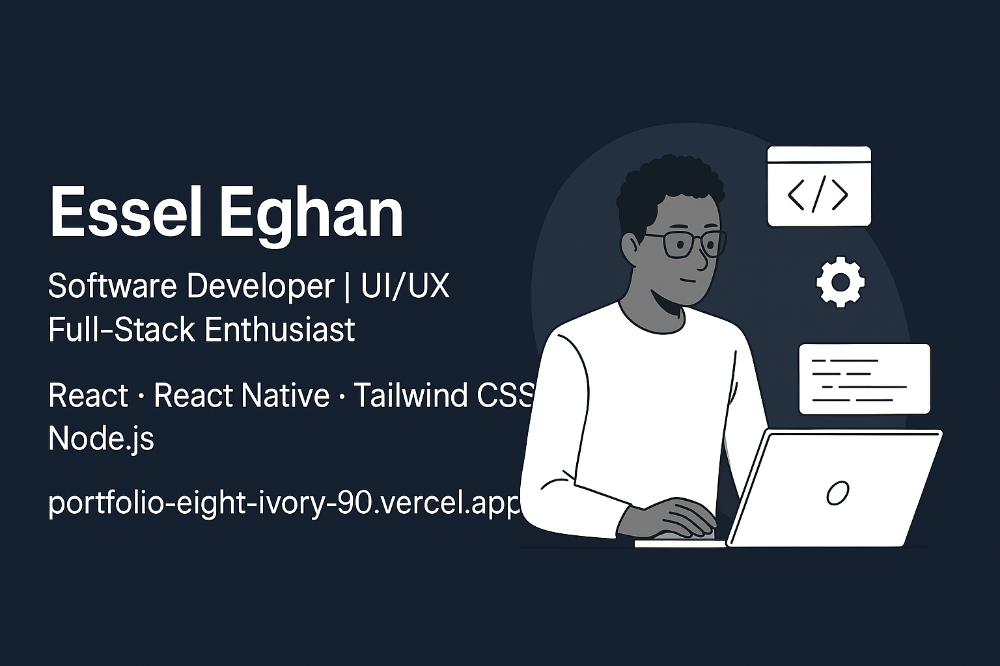

<h1 align="center">Hello World, I'm Essel Eghan! </h1>

<p align="center">
  <a href="https://git.io/typing-svg">
    
  </a>
</p>

<div align="center">
  
  <a href="https://github.com/hydi-official?tab=followers">
    
  </a>
</div>

## 👨‍💻 About Me

```javascript
const getEsselProfile = () => {
  return {
    education: "BSc Information Technology, University of Ghana (2025)",
    code: ["Java", "Python", "C#", "PHP", "JavaScript", "TypeScript"],
    tools: {
      frontend: ["React", "React Native", "Tailwind CSS", "HTML/CSS"],
      backend: ["Node.js", "Express", "ASP.NET MVC", "PHP"],
      database: ["MySQL", "MongoDB", "Firebase"],
      design: ["Figma", "Adobe XD"],
      other: ["Unity", "GitHub", "REST API", "Cloudinary", "WordPress"]
    },
    experience: [
      { company: "NCR Ghana", role: "Software Development Intern", duration: "Aug 2023 - Sep 2023" },
      { company: "Sojourn Cabins", role: "Frontend Developer", duration: "May 2023 - Aug 2023" }
    ],
    currentFocus: "Building scalable applications with great user experiences",
    funFact: "I balance coding with fitness and create games in Unity!",
    getContact: () => ({
      email: "esseldacosta00@gmail.com",
      linkedin: "linkedin.com/in/essel-eghan-9a0b52230",
      portfolio: "portfolio-eight-ivory-90.vercel.app"
    })
  };
};

// Run getEsselProfile() to learn more about me!
```

## 📊 GitHub Analytics

<div align="center">
  
  
</div>

<div align="center">
  
</div>

## 🛠️ Technical Proficiency

<table align="center">
  <tr>
    <td align="center" width="96">
      
      <br>Java
    </td>
    <td align="center" width="96">
      
      <br>Python
    </td>
    <td align="center" width="96">
      
      <br>C#
    </td>
    <td align="center" width="96">
      
      <br>JavaScript
    </td>
    <td align="center" width="96">
      
      <br>TypeScript
    </td>
    <td align="center" width="96">
      
      <br>React
    </td>
    <td align="center" width="96">
      
      <br>MySQL
    </td>
  </tr>
  <tr>
    <td align="center" width="96">
      
      <br>Node.js
    </td>
    <td align="center" width="96">
      
      <br>Tailwind
    </td>
    <td align="center" width="96">
      
      <br>Express
    </td>
    <td align="center" width="96">
      
      <br>MongoDB
    </td>
    <td align="center" width="96">
      
      <br>Firebase
    </td>
    <td align="center" width="96">
      
      <br>Unity
    </td>
    <td align="center" width="96">
      
      <br>Figma
    </td>
  </tr>
</table>

<details>
  <summary>📄 More Skills</summary>
  <br>
  
</details>

## 🏆 Featured Projects

<div align="center">
  <a href="#">
    
  </a>
  <a href="#">
    
  </a>
</div>
<br>
<div align="center">
  <a href="#">
    
  </a>
  <a href="#">
    
  </a>
</div>

### 💼 Project Showcase

| Project | Description | Tech Stack |
|---------|-------------|------------|
| 🏡 **Multi-Vendor Real Estate App** | A scalable property management system for agents, landlords, and buyers | React, Node.js, Express, Tailwind CSS |
| 🩺 **Healthcare Management System** | Platform for finding healthcare providers and booking appointments | React, Tailwind CSS, MongoDB |
| 🧳 **Sojourn Cabins Dashboard** | Guest management dashboard for booking and service coordination | React.js, Tailwind CSS |
| 🛒 **E-Commerce Platform** | Web-based storefront for browsing and purchasing products | React, Tailwind CSS, Node.js |
| 🎮 **FPS Game** | Immersive first-person shooter with dynamic environments | Unity, C# |
| 🚭 **Quit Smoking App** | Health tracker with habit logging and chatbot interaction | React Native, Firebase |

## 🐍 Animated Contribution Snake

<div align="center">
  <picture>
    <source media="(prefers-color-scheme: dark)" srcset="https://raw.githubusercontent.com/hydi-official/hydi-official/output/github-contribution-grid-snake-dark.svg" />
    <source media="(prefers-color-scheme: light)" srcset="https://raw.githubusercontent.com/hydi-official/hydi-official/output/github-contribution-grid-snake.svg" />
    
  </picture>
</div>

<div align="center">
  <h3>🔄 Watch My Contributions Grow! 🔄</h3>
</div>

## 📈 Contribution Activity

<div align="center">
  
</div>

<div align="center">
  
</div>

## 📌 Quick Links

<p align="center">
  <a href="https://linkedin.com/in/essel-eghan-9a0b52230">
    
  </a>
  <a href="https://portfolio-eight-ivory-90.vercel.app">
    
  </a>
  <a href="https://github.com/hydi-official">
    
  </a>
  <a href="mailto:esseldacosta00@gmail.com">
    
  </a>
  <a href="tel:+233595309592">
    
  </a>
</p>

## 🚀 Current Learning Path

<div align="center">
  
  
  
</div>

## 🔮 Certification Journey

<div align="center">
  <a href="#">
    
  </a>
  <a href="#">
    
  </a>
  <a href="#">
    
  </a>
</div>

<br>

<div align="center">
  
</div>

<h3 align="center">✨ Let's connect and build something amazing together! ✨</h3>

<div align="center">
  <p>
    
  </p>
  <p>
    "Code today for a better world tomorrow." — Essel Eghan
  </p>
</div>

<!-- GitHub Action for Snake Animation -->
<!-- Add this to your .github/workflows/snake.yml file:
name: Generate Snake

on:
  schedule:
    - cron: "0 */6 * * *"  # Runs every 6 hours
  workflow_dispatch:

jobs:
  build:
    runs-on: ubuntu-latest
    steps:
      - uses: actions/checkout@v3
      - uses: Platane/snk@v3
        id: snake-gif
        with:
          github_user_name: hydi-official
          outputs: |
            dist/github-contribution-grid-snake.svg
            dist/github-contribution-grid-snake-dark.svg?palette=github-dark
          
      - uses: crazy-max/ghaction-github-pages@v3
        with:
          target_branch: output
          build_dir: dist
        env:
          GITHUB_TOKEN: ${{ secrets.GITHUB_TOKEN }}
-->
